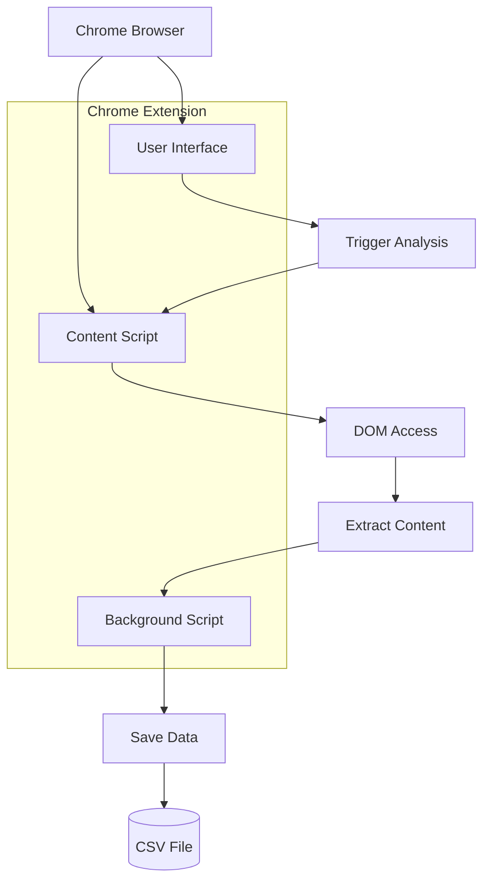

# Event Analyzer Chrome Extension

This Chrome extension finds event links on web pages and analyzes their content, extracting information like the page title, meta description, H1 text, and event details. The extracted data is then saved as a CSV file for easy viewing and analysis.

## How to Use

1. Load the extension into Chrome by navigating to `chrome://extensions`, enabling "Developer mode", and clicking "Load unpacked" to select the extension directory.
2. Log in to meetup.com and navigate to the past events page.
3. Click the extension icon to initiate the analysis process.
4. Keep the browser window open until the extension completes execution and generates the CSV file.

**Warning:** You must be logged in to meetup and on the past events page for the extension to work correctly.
